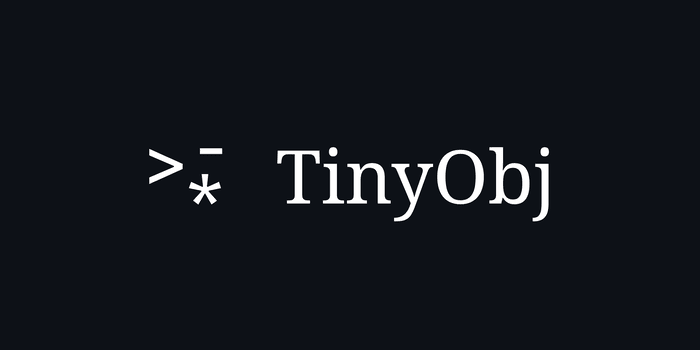

<div align="center">



**A tiny, cool data format with syntax freedom.**

[](https://github.com/tyydev1/tinyobj/)
[](https://tobj.readthedocs.io/en/latest/)

[](LICENSE)


[](https://pypi.org/project/tobj)


[](http://mypy-lang.org/)

</div>

Designed for simplicity, flexibility, and clarity.

### Table of Contents

- [Prerequisites](#prerequisites)
- [Installation](#installation)
- [Usage](#usage)
- [TOBJ Syntax Examples](#tobj-syntax-examples)
- [Features](#features)
- [Why TOBJ](#why-tinyobj)
- [Contributing](#contributing)
- [License](#license)

---

## Prerequisites

- **Python** - 3.8 or higher
- **The _tinycolors_ library**: 0.6.0 or higher (is only used for pretty testing)

  Install using:

  ```bash
  pip install tinycolors
  # or however your venv manager allows
  ```

## Installation

Install `tobj` using the `pip` package manager:

```bash
pip install tobj
```

Or use whatever package manager is used inside your venv, such as

```bash
uv add tobj
# or
pipx install tobj
# ...
```

## Usage

Use `tobj` as you will inside your projects as a module; write and read files like you would in a JSON manner.

```py
import tobj

with open('example.tobj', 'r') as f:
    result = tobj.load(f) # 'result' is now the loaded content
                          # of the .tobj file in dict form!
    tobj.dump({"User": {"name": "Alice", "age": 20, "balance": 2000}}, f)

manual_result = tobj.loads("*User>name Alice>age 20>balance 2000") # {"User": {"name": "Alice", "age": 20, "balance": 2000}}
manual_dumps  = tobj.dumps({"User": {"name": "Alice", "age": 20, "balance": 2000}}) # *User>name Alice>age 20>balance 2000
```

## TOBJ Syntax Examples

TOBJ is designed to be simple and human-readable. Here’s a quick overview of its syntax:

- **Objects**: Start with `*` followed by the object name (e.g., `*User`).
- **Properties**: Use `>` to define properties (e.g., `> name Alice`).
- **Comments**: Use `#` or `//` to add comments.
- **Lists**: Use `-` to define list items (e.g., `> favorites - python - rust`).
- **Strings**: Wrap strings in quotes (e.g., `> bio "Hello World"`).
- **Special Keywords**: Use `true`, `false`, and `nothing` for booleans and null values.

For more information, [RTFM on ReadTheDocs](https://tobj.readthedocs.io/en/latest/).

Here's a comprehensive example:

```tobj
*$ // supports this comment; the $ symbol is supported, and conventionally used as a 'global' object
> key ctrl+alt+c
> action "Suspend Machine"
> timeout 10

*User # supports this comment to!
    > name      Alice
    > age       30
    > active    true # special keyword
    > pet       nothing # special 'null' keyword

*User.profile # use dot paths to represent hierarchical objects
    > bio       "Hello World"
    > score     9001

*User.tags
    > favorites
        - python
        - rust
        - C++
    > "nothing" nothing # also use strings as the property identifier to avoid colliding with keyword
```

## Features

TinyObj is not designed to be a JSON replacement or to be blazing fast, but it offers:

- [x] **Zero** dependencies
- [x] Actually supports comment (side eye for you-know-who)
- [x] Deterministic parsing
- [x] Minimal syntax without (scary) brackets
- [x] Flexible, ignores most whitespace, tabs, and newlines.

## Why TinyObj?

JSON is verbose, fragile for humans, and painful to diff.
TinyObj is designed for:

- Human readability
- Minimal syntax
- Easy parsing

## Contributing

Contributions are welcome! Fork the repo, create a branch, and craft your great creations, then submit a Pull Request.

## License

This project is licensed under the MIT License - see [LICENSE](LICENSE) (or the LICENSE badge) for details.

## Documentation

In case you missed it, [here's the documentation](https://tobj.readthedocs.io/en/latest/), and the [GitHub repo](https://github.com/tyydev1/tinyobj).
